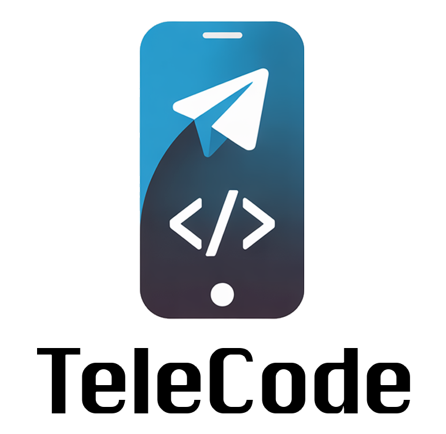

<div align="center">
  
  
  # TeleCode Bot
  
  *A powerful Telegram bot that integrates multiple LLM providers to help you with coding tasks and automatically commit changes to your GitHub repositories.*
</div>

## Features

🤖 **AI-Powered Coding Assistant**
- Send coding prompts via Telegram
- Multiple LLM providers: Claude Code SDK, Together AI, OpenAI
- Supports complex multi-file projects
- Intelligent repository context analysis

🔧 **GitHub Integration**
- Automatic repository cloning and management
- Creates feature branches for each task
- Commits and pushes changes with descriptive messages
- Supports both public and private repositories

🔒 **Security & Rate Limiting**
- User authorization whitelist
- Rate limiting (hourly and daily limits)
- Repository access control
- Secure token management

📝 **Advanced Features**
- **Intelligent Repository Context**: Analyzes codebase structure and includes relevant files automatically
- **Chat Context Management**: Maintains conversation history for improved AI responses
- **Multi-Language Support**: Full English and Portuguese localization with persistent preferences
- **Smart File Selection**: Uses keyword analysis to select most relevant files for context
- **Token Management**: Built-in cost estimation and token counting
- **Flexible Git Strategy**: Choose between branch-based or direct commits

## Commands

- `/start` - Get started with the bot
- `/help` - Show detailed help information
- `/repo <github_url>` - Set your active repository
- `/code <prompt>` - Execute a coding task
- `/ask <question>` - Analyze code and answer questions (read-only)
- `/status` - Check current repository and usage stats

## Quick Start

### 1. Set up the Bot

1. **Create a Telegram Bot**:
   - Message [@BotFather](https://t.me/BotFather) on Telegram
   - Use `/newbot` to create a new bot
   - Save the bot token

2. **Get API Keys**:
   - **Together AI API Key**: Get from [Together AI Console](https://api.together.xyz/) (Recommended)
   - **Anthropic API Key**: Get from [Anthropic Console](https://console.anthropic.com/) (Alternative)
   - **OpenAI API Key**: Get from [OpenAI Console](https://platform.openai.com/api-keys) (Alternative)
   - **GitHub Token**: Create at [GitHub Settings > Developer settings > Personal access tokens](https://github.com/settings/tokens)

3. **Configure Repository Access**:
   - Ensure your GitHub token has access to repositories you want to work with
   - For private repos, make sure the token has appropriate permissions

### 2. Deploy to Railway

[](https://railway.com/deploy/telecode?referralCode=YC-2HP)

1. Click the deploy button above
2. Set the following environment variables:

**For OpenRouter (Recommended):**
```env
BOT_TOKEN=your_telegram_bot_token
LLM_PROVIDER=openrouter
OPENROUTER_API_KEY=your_openrouter_api_key
OPENROUTER_MODEL=openai/gpt-4o
GITHUB_TOKEN=your_github_personal_access_token
AUTHORIZED_TELEGRAM_USERS=your_telegram_user_id
# Optional for leaderboards
OPENROUTER_SITE_URL=https://yoursite.com
OPENROUTER_SITE_NAME=YourSiteName
```

**For Together AI (Cost-Effective):**
```env
BOT_TOKEN=your_telegram_bot_token
LLM_PROVIDER=together
TOGETHER_API_KEY=your_together_api_key
TOGETHER_MODEL=meta-llama/Llama-3.3-70B-Instruct-Turbo
GITHUB_TOKEN=your_github_personal_access_token
AUTHORIZED_TELEGRAM_USERS=your_telegram_user_id
```


**For OpenAI:**
```env
BOT_TOKEN=your_telegram_bot_token
LLM_PROVIDER=openai
OPENAI_API_KEY=your_openai_api_key
OPENAI_MODEL=gpt-4
GITHUB_TOKEN=your_github_personal_access_token
AUTHORIZED_TELEGRAM_USERS=your_telegram_user_id
```

3. Deploy and get your bot URL

### 3. Using the Bot

1. **Set up repository**:
   ```
   /repo https://github.com/yourusername/your-repo
   ```

2. **Execute coding tasks**:
   ```
   /code add input validation to the user registration form
   /code refactor the database connection module
   /ask explain how the authentication system works
   /ask where is the login function defined
   ```

3. **Check status**:
   ```
   /status
   ```

## Environment Variables

### Required Variables

| Variable | Description | Example |
|----------|-------------|---------|
| `BOT_TOKEN` | Telegram bot token from BotFather | `123456:ABC-DEF1234ghIkl-zyx57W2v1u123ew11` |
| `LLM_PROVIDER` | LLM provider (`openrouter`, `together`, `openai`) | `openrouter` |
| `TOGETHER_API_KEY` | Together AI API key (if using Together) | `your-together-api-key` |
| `OPENROUTER_API_KEY` | OpenRouter API key (if using OpenRouter) | `sk-or-v1-...` |
| `OPENAI_API_KEY` | OpenAI API key (if using OpenAI) | `sk-proj-...` |
| `GITHUB_TOKEN` | GitHub personal access token | `ghp_1234567890abcdef...` |

### Optional Variables

| Variable | Description | Default |
|----------|-------------|---------|
| `TOGETHER_MODEL` | Together AI model to use | `meta-llama/Llama-3.3-70B-Instruct-Turbo` |
| `OPENAI_MODEL` | OpenAI model to use | `gpt-4` |
| `AUTHORIZED_TELEGRAM_USERS` | Comma-separated user IDs | All users allowed |
| `MAX_REQUESTS_PER_HOUR` | Hourly rate limit | `10` |
| `MAX_REQUESTS_PER_DAY` | Daily rate limit | `50` |
| `ALLOWED_REPOS_GLOBAL` | Global allowed repositories | No restrictions |
| `ALLOWED_REPOS_USER_<USER_ID>` | Per-user repository access | No restrictions |

### LLM Provider Options

**Together AI (Recommended - Cost Effective)**
- `meta-llama/Llama-3.3-70B-Instruct-Turbo` (Default)
- `meta-llama/Llama-3.1-70B-Instruct-Turbo`
- `mistralai/Mixtral-8x7B-Instruct-v0.1`
- `microsoft/WizardLM-2-8x22B`

**Anthropic Claude (High Quality)**
- Uses Claude Code SDK with latest Claude models
- Best for complex code analysis and generation

**OpenAI (Reliable)**
- `gpt-4` (Default)
- `gpt-4-turbo`
- `gpt-3.5-turbo`

## Local Development

1. **Clone the repository**:
   ```bash
   git clone <your-repo>
   cd ctlapp
   ```

2. **Install dependencies**:
   ```bash
   pip install -r requirements.txt
   npm install -g @anthropic-ai/claude-code
   ```

3. **Set up environment**:
   ```bash
   cp .env.example .env
   # Edit .env with your tokens
   ```

4. **Run the bot**:
   ```bash
   python bot.py
   ```

## Security Best Practices

- **Never commit tokens** to your repository
- **Use environment variables** for all sensitive data
- **Limit repository access** using `ALLOWED_REPOS_*` variables
- **Set up user authorization** with `AUTHORIZED_TELEGRAM_USERS`
- **Monitor usage** through logs and rate limiting

## Architecture

```
┌─────────────────┐    ┌─────────────────┐    ┌─────────────────┐
│   Telegram Bot  │ -> │   LLM Provider  │ -> │  GitHub Manager │
│    (bot.py)     │    │ (OpenRouter/etc)│    │ (github_mgr.py) │
└─────────────────┘    └─────────────────┘    └─────────────────┘
         │                       │                       │
         v                       v                       v
┌─────────────────┐    ┌─────────────────┐    ┌─────────────────┐
│   Security      │    │   Chat Context  │    │ Advanced Repo   │
│   Manager       │    │   Manager       │    │ Context System  │
└─────────────────┘    └─────────────────┘    └─────────────────┘
         │                       │                       │
         v                       v                       v
┌─────────────────┐    ┌─────────────────┐    ┌─────────────────┐
│  Localization   │    │ Approval Manager│    │   File Creation │
│   Manager       │    │ (future feature)│    │   & Git Commits │
└─────────────────┘    └─────────────────┘    └─────────────────┘
```

## Contributing

1. Fork the repository
2. Create a feature branch
3. Make your changes
4. Test thoroughly
5. Submit a pull request

## License

MIT License - see LICENSE file for details.

## Support

If you encounter issues:

1. Check the logs in Railway dashboard
2. Verify all environment variables are set correctly
3. Ensure your GitHub token has proper permissions
4. Make sure your repository is accessible

For bugs and feature requests, please open an issue on GitHub.